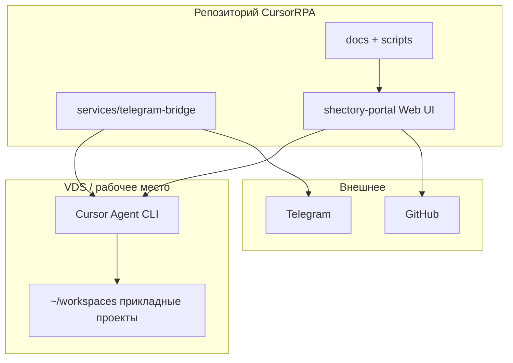

# Реестр инициатив Shectory

Источник правды для путей и ролей серверов. **Секреты и значения `.env` сюда не пишутся** — только имена переменных, если нужно, в колонке `notes`.

**Модель репозитория:** репозиторий **CursorRPA** считается **монолитом**: в одном Git-хранилище лежат `docs/`, `scripts/`, `services/telegram-bridge/`, каталог **`shectory-portal/`** (исходники Web UI). **VDS Shectory — это та же машина**, где лежит клон (например `~/workspaces/CursorRPA`); прод-сборка портала делается **на месте** скриптом `scripts/deploy-shectory-portal.sh` из корня клона. Зафиксируйте фактический `WorkingDirectory` в unit `shectory-portal.service` (часто user-unit под `shectory`).

Обновляйте при смене папок клонов или `git remote`.

**Последнее исследование:** 2026-03-31 (общий хост с Node: **`docs/raspi-safe-node-process-management-ru.md`**, **`scripts/kill-node-in-workdir.sh`**; ранее — структура `~/workspaces`, `prisma/seed.ts`, SSH `shectory-work`).

---

## Архитектура монолита CursorRPA (логическая)

---

## Таблица

| short_id    | name             | stage            | app_url                    | path_shectory (VDS)                     | git_remote                                                                              | github_access (2026-03-24) | hoster_role                       | stack                  | notes                                                                                                                         |
| ----------- | ---------------- | ---------------- | -------------------------- | --------------------------------------- | --------------------------------------------------------------------------------------- | -------------------------- | --------------------------------- | ---------------------- | ----------------------------------------------------------------------------------------------------------------------------- |
| cursor-rpa  | CursorRPA (монолит) | dev + portal prod | `https://shectory.ru` (UI) | `/home/shectory/workspaces/CursorRPA`   | `https://github.com/Shevbo/CursorRPA.git`                                               | ok (`git ls-remote`)       | Web UI портала на VDS             | docs, scripts, Next.js в `shectory-portal/`, Python bridge | Один репозиторий: доки, скрипты, **Shectory Portal** (`shectory-portal/`), **Telegram bridge**. Публичный UI: `shectory.ru`. Unit: `shectory-portal.service`. |
| komissionka | Комиссионка      | dev / prod split | `https://komissionka92.ru` | `/home/shectory/workspaces/komissionka` | `https://github.com/Shevbo/komissionka-app.git`                                         | ok (`git ls-remote`)       | prod DB/UI/API на Hoster          | Prisma, Postgres, web  | Прод URL: `https://komissionka92.ru`.                                                                                           |
| piranha-ai  | PiranhaAI        | dev              | `-`                        | `/home/shectory/workspaces/PiranhaAI`   | *нет `.git` в корне проекта (portable)*                                                 | n/a                        | по продукту                       | .NET / native          | Проект в portable-режиме, remote в корне не зафиксирован.                                                                       |
| pingmaster  | PingMaster       | requirements     | `-`                        | `/home/shectory/workspaces/PingMaster`  | локальный git инициализирован (remote не настроен)                                      | partial                    | нет prod на Hoster (requirements) | Android                | Workspace приведён к базовому стандарту (README, RUNBOOK, ARCHITECTURE, scripts/deploy.sh). Нужны remote и прод-инфра.      |
| ourdiary    | Наш дневник (ourdiary) | dev         | `https://ourdiary.shectory.ru` (nginx→`127.0.0.1:3002`, PM2) | `/home/shectory/workspaces/ourdiary`    | `git@github.com:Shevbo/ourdiary.git`                                                    | ok                         | prod на Hoster (Postgres локально) | Next.js 16, Prisma, NextAuth | Публичный URL и nginx: **`ourdiary/RUNBOOK.md`** → «Внешний URL». Первичная установка: **`scripts/bootstrap-hoster.sh`**. Деплой: **`deploy-project.sh ourdiary hoster`**. PM2: **`ecosystem.config.cjs`**, порт **3002**. |

---

## Связь с `~/workspaces` (shectory-work)

| Каталог в `~/workspaces`                 | Содержимое (на дату исследования)               | Куда смотрит код                                 |
| ---------------------------------------- | ----------------------------------------------- | ------------------------------------------------ |
| `/home/shectory/workspaces/CursorRPA`    | git-клон монолита: docs, scripts, `shectory-portal/`, `services/telegram-bridge/` | репозиторий **CursorRPA**; Web UI — подкаталог `shectory-portal/` |
| `/home/shectory/workspaces/komissionka`  | git-клон продукта komissionka                   | рабочая копия проекта komissionka                |
| `/home/shectory/workspaces/PiranhaAI`    | проект в portable-режиме                         | рабочая копия проекта PiranhaAI                  |
| `/home/shectory/workspaces/PingMaster`   | базовый bootstrap по стандарту Shectory          | рабочая копия проекта PingMaster                 |
| `/home/shectory/workspaces/ourdiary`     | семейный дневник: лента, календарь, расходы, TV  | репозиторий **ourdiary**                         |

---

## Соглашения

- `path_shectory`: единый корень `~/workspaces` (пользователь `shectory` на VDS). Имена каталогов на VDS синхронизируются с порталом из файловой системы; мета-проект `shectory-portal` в БД задаётся в [prisma/seed.ts](../prisma/seed.ts). Отдельная строка реестра «shectory-portal» как соседний клон **не используется** — UI входит в монолит `CursorRPA`. Схема БД: [prisma-cursorrpa.md](prisma-cursorrpa.md).
- `git_remote`: без токенов в URL; при приватном доступе — `ssh: git@github.com:...` без ключей в файле.
- `app_url`: отдельная колонка для публичного URL приложения (если есть). Для внутренних сервисов использовать `-`.

