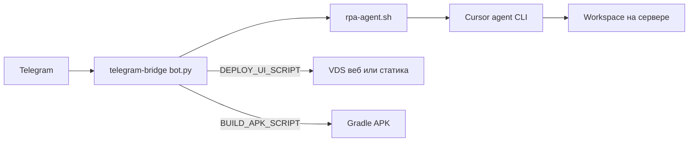

# Сценарий: Telegram → Cursor на сервере → прототип на VDS → APK

## Архитектура (целевая)

- **Вся разработка в Telegram:** пользователь шлёт текст боту; бот вызывает `agent` в выбранном workspace и тем же чатом Cursor (`--resume`).
- **Весь стек на сервере:** Python-бот, `rpa-agent.sh`, Cursor CLI, (опционально) Node/Java/Android SDK для сборок.
- **Прототип UI на VDS:** после того как агент собрал статику (например `web/dist`), команда `/deploy_ui` запускает ваш скрипт (`rsync`/`scp`/`docker`) на VDS с nginx/Caddy.
- **MVP в APK:** когда в репозитории есть Android-модуль, `/build_apk` запускает ваш скрипт с `./gradlew assembleDebug` (нужны SDK и часто много места на диске).

## Реализовано в репозитории

| Компонент | Путь |
|-----------|------|
| Обёртка RPA | [scripts/rpa-agent.sh](../scripts/rpa-agent.sh) |
| Telegram-мост | [services/telegram-bridge/bot.py](../services/telegram-bridge/bot.py) |
| Пример env | [services/telegram-bridge/config.example.env](../services/telegram-bridge/config.example.env) |
| Пример systemd | [services/telegram-bridge/systemd/cursor-telegram-bridge.service.example](../services/telegram-bridge/systemd/cursor-telegram-bridge.service.example) |
| Заглушки скриптов | [scripts/example-deploy-ui.sh](../scripts/example-deploy-ui.sh), [scripts/example-build-apk.sh](../scripts/example-build-apk.sh) |

## Пилотный бот (стабильность)

- Переменная **`CURSOR_RPA_FIXED_WORKSPACE`** — один бот привязан к одному каталогу; `/project` отключён.
- **Очередь на Telegram-чат:** параллельных вызовов `agent` нет; при занятости пользователь видит явное сообщение.
- **Индикатор набора**, **разбиение длинных ответов** на части `[1/N]`, **код выхода** агента в ответе при ошибке.
- **`/ping`**, **`/help`**, **`/status`** (в т.ч. «очередь занята»).

## Поток для пользователя в Telegram

1. `/project имя_проекта` — создаётся `WORKSPACE_ROOT/имя_проекта` (не нужно, если задан `CURSOR_RPA_FIXED_WORKSPACE`).
2. `/newchat [первый промпт]` — `agent create-chat`, сохраняется UUID; опционально сразу первый запрос агенту.
3. Любой текст — `QUERY` в текущий чат (правки кода, инструкции по деплою и т.д.).
4. `/deploy_ui` — выполняется `DEPLOY_UI_SCRIPT` (если задан в `.env`).
5. `/build_apk` — выполняется `BUILD_APK_SCRIPT`.
6. `/status` — текущий workspace и chat id.

Для правок с записью файлов агент обычно достаточно `QUERY`; если нужен принудительный режим с `--force`, в бот можно позже добавить команду `/apply` (сейчас не реализовано).

## Что требуется от вас

1. **Telegram:** создать бота через [@BotFather](https://t.me/BotFather), получить токен; узнать свой **числовой user id** (@userinfobot) и прописать в `TELEGRAM_ALLOWED_USER_IDS`.
2. **Сервер (dev-rpa):** Python venv, зависимости, файл `.env`, запуск `bot.py` или systemd (см. [services/telegram-bridge/README.md](../services/telegram-bridge/README.md)).
3. **Cursor:** `CURSOR_API_KEY` в `~/.config/cursor-rpa/env.sh` (как уже настроено) или в `.env` бота.
4. **VDS для UI:** учётка SSH, каталог под статику, nginx (или Docker) — вы дописываете [scripts/example-deploy-ui.sh](../scripts/example-deploy-ui.sh) и путь в `DEPLOY_UI_SCRIPT=bash /path/to/deploy.sh` (одна строка в `.env`).
5. **Android SDK / Gradle:** установка на сервере (часто `sudo` и десятки ГБ) — затем раскомментировать логику в [scripts/example-build-apk.sh](../scripts/example-build-apk.sh) и указать `BUILD_APK_SCRIPT`.
6. **Сеть:** Telegram должен доставлять webhook/long polling до сервера; если сервер за NAT без IPv4 — нужен внешний доступ или хостинг с белым IP.

## Ограничения и риски

- Долгие запросы агента блокируют ответ бота до таймаута (`AGENT_TIMEOUT_SEC`).
- Один пользователь — лучше сериализовать запросы; параллельные сообщения в один чат Cursor могут конфликтовать.
- Секреты не храните в git; `.env` и `env.sh` — права `600`.
- Юридически и по ToS использование Cursor API с автоматизацией — ваша ответственность.

## Следующие улучшения (по желанию)

- Команда `/apply` для `APPLY` (`--force`).
- Очередь задач (Redis / файл lock).
- Webhook вместо polling при наличии HTTPS и домена.
- Отдельный VDS только для бота и отдельный для UI.
